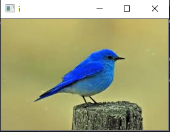
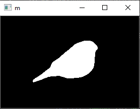
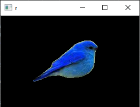

# Image-segmentation-using-Thresholding-Segmentation

There are three ways to do image segmentation - 
1 Color segmentation or thresholding segmentation
2 Edge detection 
3 Semantic segmentation

In this code I have performed thresholding segmentation. 

Image 

Mask 

Segmented Image

